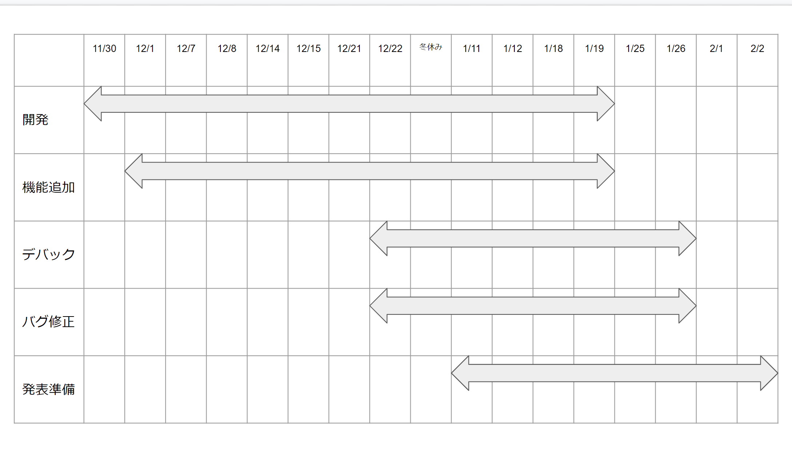

<!--_class: lead-->

# 学内チャットツール
## NT25-A 6班

1. K021C1258/阿部 拓海  
2. K021C1260/唐澤 克幸  
3. K021C1252/松本 智紀  
4. K021C1259/大槻 諒
5. K021C1248/加藤 好太  
6. K021C1286/小出 佑希  


---
<!--
_class: lead
header: 先行開発(Slack Alternative)
-->
# Slackのオープンソースな代替

|                                                                                                                                                         |                                                                                                                                       | 
| :-----------------------------------------------------------------------------------------------------------------------------------------------------: | ------------------------------------------------------------------------------------------------------------------------------------- | 
| [](https://github.com/vector-im/element-web)               | [](https://github.com/zulip/zulip)                                  | 
| [](https://github.com/mattermost/mattermost-server) | [](https://github.com/RocketChat/Rocket.Chat) | 
| [](https://github.com/traPtitech/traQ)                                        | [](https://github.com/fosscord/fosscord)                | 

---

<!-- header: Why -->

# なぜ作ろうとしたか

1. 学内のチャットツール(教師用/生徒用)がバラバラ
2. 既存のシステムの外部依存
3. ChatworkやSlackが抱える問題
4. 学内で保守できるような環境がある(AWS)
5. プライベート端末で使用する
6. ファイル周りの管理
7. 料金体系などの問題

---

# 学内のチャットツールがバラバラ
- 管理がしづらい
- 教員ごとにツールが違うせいで連絡が取りづらい
- classroomでしか反応してくれない教員がいるため非常に連絡がしづらい
- 細かな連絡を取りたいが、担任でない場合はClassroom以外に選択肢がない

---

# 既存システムの外部依存
- なぜかGoogle Workspaceが活用できていない
- もし、外部のツールの場合なにか問題が発生した際のバックアップがない
- 追跡や情報収集を嫌う人が一定数いるという部分の解消(degoogle)
- Google Chatのバックアップ要員がいない

---

# ChatworkやSlackが抱える問題
- フリープランの全体的な制限(Slack)
- それに加え、一定期間経過するとログが残らない(Chatwork)
- 広告やメールへの通知、そもそもの機能不足などの問題
- フリープランの商用利用におけるライセンスなど
- 後にも出てくる料金の負担

---

# 学内で保守できる環境がある
- AWSが比較的自由に使える環境がある
- OSSなのでオンプレミスで使うことも可能
- OSSかつ学生のリソースでも可能
- 派生のインスタンスなど
- Webサービスのためオンプレミスとは違い保守が楽

---

# プライベート端末で使用する
- 教員によっていれるソフトウェアがバラバラのため複数必要
- UIや操作性の一貫性が取れない
- ブラウザからのアクセスができること(PWAやレスポンシブ対応)
    - ネイティブアプリは本末転倒
- 通信環境に限らず軽快な動作が必要

---

# ファイル周りの管理
- ブラウザ内でプレビュー対応などがないとDLが必要
- 教員によってはClassroomオンリーでファイルを投稿してくることも(5GB超のLinuxイメージなど)
    - 紙媒体が排除されない原因の一環
- 一定のファイルサイズを受け入れない
- オープンソースなどのファイルを再配布する際のライセンス違反がみられる
---

# 料金体系
- 無料で使おうとする教員がほとんどのため、ツールが分散しすぎている
- 海外のツールが多いため、日本円での内課金にはそれなりの追加コスト
    - 国内は...(よくてChatwork)
- 誰が負担するのかという問題点
    - 生徒に複数のプラン契約をさせるのは現実的ではない
- フリープランのような体制が突如切られる可能性
    - 今回のChatworkは実質的なフリープラン打ち切り
　
---
<!-- header: What -->
# 機能概要
1. チャンネルの管理
2. 拡張性(API周りやカスタムテーマを扱えるようにする)
3. 軽量・シンプルかつ誰でも扱えるようなUIとサーバー(React.JS Socket.IO)
4. Google OAuth
6. AWS EC2を採用

**があり、かつOSSなチャットツール**

---

# チャンネルの管理
- チャンネルの追加
- チャンネルの削除
- チャンネルの権限設定
- 音声チャット
etc...

各種ツールにも実装されてる機能を実装する

---

# 拡張性
- コンパクトな動作を目指してTailwindを採用
- Socket.IOでリアルタイム双方向通信が可能
- Node.jsによる実装のため拡張性が高い
- OSSのため実装されている機能の透明性が高い
    - マルウェアなどの心配性を減らすことができる
- 実装したい機能があればそれを望む本人が実装できる
    - そこからさらに自分でカスタマイズしてホスティングも可能

---

# Google OAuth
- Passportを使用した実装
- Google Workspaceアカウントの活用
    - 学内でもっとも使用されるので組み込みたい
- 実装が複雑ではない

> 現在のところは最後に実装する想定なので、後々実装を変更する可能性がある
---

# AWSを採用
- デプロイ専用
- オンプレミスでの保守は人件費が大きい
    - オンプレミスは今回は想定しない
    - リソース不足も懸念
- EC2以外にも採用しやすい
- AWS以外も想定した
    - 今回は決済面で諦めた

---

<!-- header: スケジュール -->
# 現在
- 自分たちがツールとして使用するのに最低限実装されているサンプルの動作確認
- 古い依存関係のアップデート
    - 完了
    - `npm-check-updates`を使用
- クライアントとサーバーのリポジトリの切り分け
    - 完了
    - npmからyarnへ移行(依存関係)

---

---

---
- サンプルは問題なく動かすことができた
- バージョン管理が難しく、マイナーバージョンへのアップデートですら苦しめられた
    - 古いバージョンを使い続けるのはセキュリティ上の問題になりかねないので慎重に行う
- 現在は`package.json`に記載があるバージョンのパッチでやり繰りしている
- サンプルの動作
<!-- 実際に動かしておく -->

---

# 実際に動かしてみる

---

# 今後
- バグの修正(既知の問題をissueとして挙げる)
- クライアントの翻訳(`react-i18next`)
- UIと追加機能の実装
- デプロイ先の選定
- CIでのデプロイの実装
- ドメイン取得
- バックエンドに集中し、クライアントやサーバーは既存のSlack Altを採用することも視野

---

<!--
color: white
_class: lead
header: 作業分担
-->
- 大まかにフロントエンドとバックエンドだが、フレキシブルに
    - あくまで小規模のため
- Pull Requestは唐澤がReview
    - 独断専行にならないことを心掛ける
- issueを投げて、みんなで解決するスタイルが望ましい
    - 根幹はNode.jsなのでバックエンドでもフロントエンドでも応用できる
- GitHubを最大限活用する
    - これによりいつでもどこでも開発ができる
    - 誰がどのように変更を行ったかが追跡しやすい

---
<!--
header: 採用技術
 -->

[GitHub](https://github.com)
[server](https://github.com/NT25-Graduation-Work/chat-app-server)
└── [`Socket.IO`](https://socket.io) - WebSocketでの双方向通信
[client](https://github.com/NT25-Graduation-Work/chat-app-client)
├── `Socket.IO`
├── [`React.js`](https://ja.reactjs.org) - WebアプリでのUI構築
└── [`Tailwind CSS`](https://tailwindcss.com) - CSSフレームワーク
[スライド](https://github.com/NT25-Graduation-Work/report.github.io)
├── [`Marp`](https://marp.app) - Markdownでスライド生成
├── `Github Pages`
└── [`Github Actions`](https://docs.github.com/ja/actions)

---

<!-- header: その他 -->
# Node.jsのバージョン管理
- Nodeのバージョンが変化するだけでもかなり動作確認に苦労する
    - 動いたバージョンで固定すればよいのでは?
    - 固定するのはなにかないか
        - [Volta](https://volta.sh/)があった `volta pin`というコマンドで固定できる
        - Voltaを使用していれば自動的にダウンロード&インストールし、固定される
```json
  "volta": {
    "node": "16.18.1",
    "yarn": "1.22.19"
  }
```
---

# 今回のスライドの解説
- テーマは[Academic](https://zenn.dev/hellorusk/articles/4edf3920dd1a35)をベースに見やすいように改善
    - ダークテーマでなにが見やすいかを考えたときに某SNSが浮かんだ
- 間違っている箇所をissueで管理
- ローカルではなく、出先でもブラウザのみで解決できるように
    - [Codespaces](https://github.co.jp/features/codespaces)を使用することでiPadからでも即座に編集
    - iPadでNode.jsを動かすのは(不可能ではない)現実的でない
        - push次第GitHub Actionsで自動的に変更を反映

---
```yaml
name: Publish GitHub Pages
on:
  push:
    branches:
      - main

jobs:
  publish:
    runs-on: ubuntu-latest
    steps:
      - uses: actions/checkout@v3

      - name: Convert Markdown into HTML and PDF
        uses: KoharaKazuya/marp-cli-action@v2

      - name: Deploy to GitHub Pages
        uses: peaceiris/actions-gh-pages@v3
        with:
          github_token: ${{ secrets.GITHUB_TOKEN }}
          publish_dir: ./
          exclude_assets: '.github,.gitignore,**.md,**.json,readme.html,**.pdf,**.lock,**.log'
```