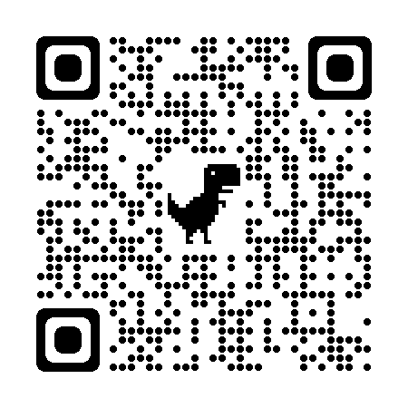
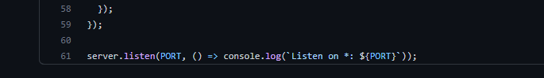
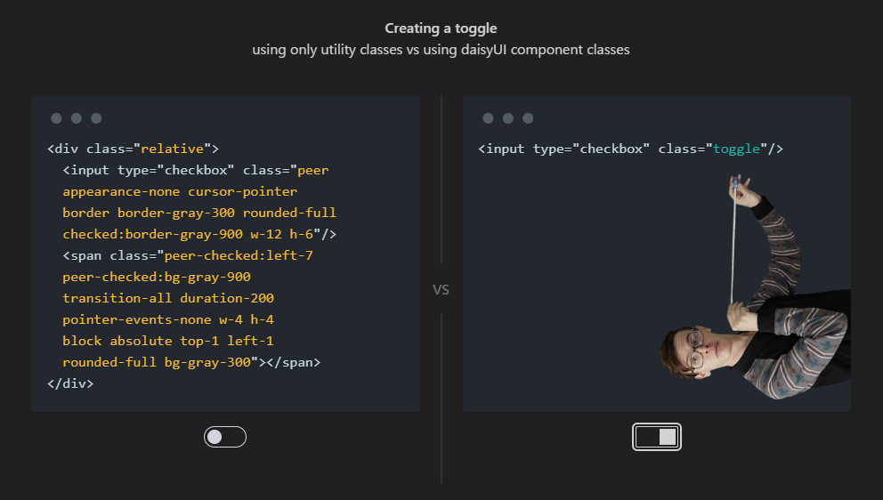
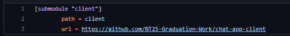

<!--_class: lead-->

# 学内チャットツール
## NT25-A 6班

K021C1258/阿部 拓海  
K021C1260/唐澤 克幸  
K021C1252/松本 智紀  
K021C1259/大槻 諒
K021C1248/加藤 好太  
K021C1286/小出 佑希  

---
<!-- _header: 動作デモ-->
URL: https://chat.nt25-chat.net  

---

# なぜ作ろうとしたか

1. 学内のチャットツール(教師用/生徒用)がバラバラ
2. 既存のシステムの外部依存
3. ChatworkやSlackが抱える問題
4. 学内で保守できるような環境がある(AWS)
5. プライベート端末で使用する
6. ファイル周りの管理
7. 料金体系などの問題

---
<!--_header: 機能 -->
# 機能概要
- チャット
    - ダイレクトメッセージ
    - 全体チャット
- 一時的なアカウント
    - 認証は未実装
- すべてのコンポーネントがオープンソース
- 軽量
- 複数言語対応(react-i18next)
- テーマ機能

---
<!-- header: 技術スタック -->

# 実装
## バックエンド
- Socket.IO
## フロントエンド
- React
- TailwindCSS
- daisyUI

---

# バックエンド
- SocketIO
    - WebScoketを手軽に扱う以上は必要
    - 導入も簡単

おかげでバックエンド側は61行と非常に少ないコードで動作している
メンテナンス性も細かく重視する必要がない ([GitHub](https://github.com/NT25-Graduation-Work/chat-app-server/blob/master/server.js))
ただ、認証などの細かい実装もできていないので方針がブレている

---
# なぜ

- 安定している
- 採用実績が多い
- Node.JSから採用するには無難
- 動作が軽量
- 秘匿性が高い

---

## フロントエンド
### React
- 無難なフロントエンド
- Next.jsではない理由
    - jsx記法がネック
    - Next.js13での破壊的変更

### TailwindCSS
- いわずもがな知られたCSSフレームワーク
    - コーディングのしやすさを重視

---

## daisyUI
- TailwindCSS用のフレームワーク
    - Tailwindの可読性の欠点を改善できる
    - テーマなどで細かく悩む必要性が少ない
- Tailwindの良い点が殺されていない
    - Tailwind用のプロファイルの様な使い方ができるので書きやすい
- 後々のテーマ切り替えの機能などの実装がしやすい
- モダンなデザイン
- 公式でコンポーネント集がそろっている
---

<!--_header: TailwindCSS vs daisyUI -->

---

<!-- header: 進捗 -->
# 現在
- いくつかの機能追加
- 古い依存関係のアップデート
    - 完了
    - `npm-check-updates`を使用
- クライアントとサーバーのリポジトリの切り分け
    - 完了
    - npmからyarnへ移行(依存関係)
---

## いくつかの機能追加
- UIの改修を行いました
    - Tailwindが古かったのでバージョンもついでに
    - daisyUIを採用し、デザインの統一感を
- i18n
    - 国際化に対応
    - react-18nextを採用
        - 翻訳する対象は多くはない
- コードの最適化
    - 冗長なコードを修正
<!-- 実際に動かしておく -->
---

## 古い依存関係のアップデート
- 結局バグ修正が一番作業として多い
    - サーバー側はコードが少量だったので少しの改修でなんとか済んだ
- フロントエンド
    - 元のコードがTailwindCSSがPostCSS8に切替わる時期だった
        - そのため`postcss7-compat`だったりなどのdaisyUI採用の弊害が大きかった
    - TailwindをPostCSS8対応したものを使うために`react`/`react-dom`を含む計10個近くの依存関係を修復する必要があった
    - 結果としては`tailwind.config.js`が`darkMode: media`にすると動かなくなるというバグを抱えているが、`false`にし、見なかったことにした

---

## クライアントとサーバーの切り分け
コードをそれぞれ同時に管理するのは非常に危険
- repoを分けた
    - その結果かなり環境の構築が面倒になった
- 保守はやりやすくなった(主に`git push`時)

これのメリットを維持したまま改善する方法を考えた結果、`git submodule`を使うことにした  

---
<!--header: これから -->
# 今後
- モバイル端末のUI改善
    - デスクトップ前提になっていて、レスポンシブ以外になにもできていない
    - React + Tailwindなのでそこまで難易度は高くない
- PWA対応
    - 比較的すぐにできる
    - これをするためにも、モバイルのUI改善は必要
- ファイルアップロードへの対応
    - AWS CloudFlontなどのCDNを採用
    - キャッシュなども積極的に採用したい

---
- Denoへの対応
    - 今後はNode.jsよりDenoが流行ると考える
    - そのためにも早い段階で対応したい
    - Aleph.jsなど

- 個人的にメンテナンスする
    - オープンソースなのでこれを機に今後もこのメンバーで好きなタイミングで改善したい
- 他のCSSも視野に入れる
    - MaterialUI
    - ChakraUI
    - Mantine UI

---
<!-- _header: まとめ -->
# 採用技術

[server](https://github.com/NT25-Graduation-Work/chat-app-server)
├── [`Socket.IO`](https://socket.io) - WebSocketでの双方向通信

└── [client](https://github.com/NT25-Graduation-Work/chat-app-client) サブモジュール化
    ├── [`React`](https://ja.reactjs.org) - WebApp構築
    ├── [`TailwindCSS`](https://tailwindcss.com) - CSSフレームワーク
    └── [`daisyUI`](https://daisyui.com/) - TailwindCSS用フレームワーク
[スライド](https://github.com/NT25-Graduation-Work/report.github.io)
├── [`Marp`](https://marp.app) - Markdownでスライド生成
└── `Github Pages`

